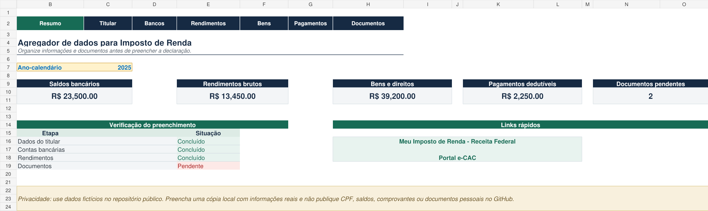
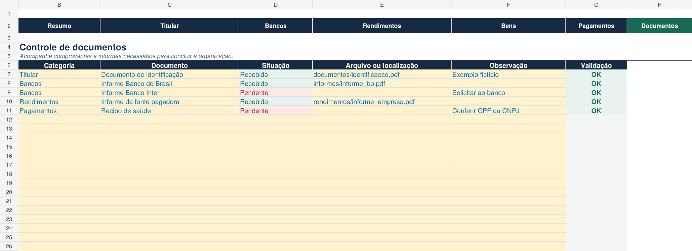

# Agregador de Dados para Imposto de Renda

Projeto desenvolvido como parte de um desafio prático da DIO. A ferramenta organiza dados e documentos utilizados na preparação da declaração de Imposto de Renda, reunindo informações pessoais, saldos bancários, rendimentos, bens, pagamentos e comprovantes em um único arquivo de Excel.



## Funcionalidades

- Painel com os principais totais cadastrados;
- Menu de navegação entre as planilhas;
- Cadastro de dados do titular;
- Controle de contas e informes bancários;
- Registro de rendimentos recebidos e imposto retido;
- Organização de bens e direitos;
- Controle de pagamentos e possíveis deduções;
- Lista de documentos recebidos e pendentes;
- Validações automáticas de preenchimento e consistência;
- Destaques automáticos para itens pendentes;
- Links rápidos para os serviços da Receita Federal.

## Estrutura do arquivo

- **Resumo:** apresenta totais, situação do preenchimento e links rápidos.
- **Titular:** reúne os dados cadastrais da pessoa física.
- **Bancos:** registra instituições, tipos de conta, saldos e informes.
- **Rendimentos:** controla os rendimentos, as fontes pagadoras e o IR retido.
- **Bens:** organiza bens e direitos e compara os valores anterior e atual.
- **Pagamentos:** registra despesas e indica possíveis deduções.
- **Documentos:** acompanha comprovantes recebidos e pendentes.
- **Listas:** armazena as opções aceitas pelas fórmulas de validação.

## Como utilizar

1. Abra `Agregador_Dados_Imposto_Renda_Izabela.xlsx` no Excel.
2. Na planilha **Resumo**, escolha o ano-calendário.
3. Use o menu superior para navegar entre as áreas.
4. Substitua os exemplos fictícios pelos dados necessários em uma cópia local.
5. Preencha as células amarelas e acompanhe a coluna **Validação**.
6. Consulte o resumo para verificar totais e documentos pendentes.

## Cálculos utilizados

Os saldos bancários, rendimentos e bens são consolidados com a função `SOMA`.

```text
Total de saldos bancários = soma dos saldos informados em 31/12
```

Os pagamentos classificados como dedutíveis são somados com `SOMASES`.

```text
Pagamentos dedutíveis = soma dos valores em que Dedutível? = Sim
```

Os documentos pendentes são contabilizados com `CONT.SES`.

```text
Documentos pendentes = quantidade de registros com situação Pendente
```

## Recursos do Excel aplicados

- Fórmulas com referências entre planilhas;
- Fórmulas de validação com `SE`, `E`, `OU`, `CONT.SES` e `ÉNÚM`;
- Formatação condicional;
- Formatação de datas e moedas;
- Links internos e externos;
- Congelamento de painéis;
- Organização visual de entradas e resultados.

## Dados de demonstração

O arquivo contém nomes, documentos, valores e empresas fictícios apenas para demonstrar o funcionamento das fórmulas e validações.

## Privacidade

Não publique no GitHub uma versão preenchida com informações reais. CPF, endereço, saldos bancários, rendimentos, recibos e documentos pessoais devem permanecer apenas em uma cópia local e protegida.



## Materiais de referência

- Lista de bancos disponibilizada no arquivo `bancos_apoio.xlsx` do desafio;
- Modelo resolvido disponibilizado no arquivo `projeto_completo.xlsx` do desafio;
- [Meu Imposto de Renda — Receita Federal](https://www.gov.br/receitafederal/pt-br/assuntos/meu-imposto-de-renda).

## Autora

Izabela
